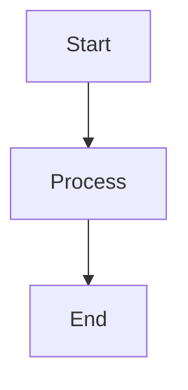

# Contributing to Documentation

Guidelines for contributing to Zpanel documentation.

## Documentation Philosophy

Good documentation is:
- **Clear**: Easy to understand for the target audience
- **Accurate**: Reflects current implementation
- **Complete**: Covers all important aspects
- **Discoverable**: Easy to find what you need
- **Maintainable**: Easy to update as code evolves

## Documentation Structure

```
docs/
├── README.md              # Documentation index
├── status.md              # Implementation status
├── api/                   # API reference
│   ├── overview.md
│   ├── authentication.md
│   └── examples.md
├── architecture/          # System design
│   ├── system-overview.md
│   ├── deployment-flow.md
│   ├── docker-orchestration.md
│   └── data-flow.md
├── guides/                # User guides
│   ├── getting-started.md
│   ├── installation.md
│   ├── ide-integration.md
│   ├── mcp-integration.md
│   └── cloudflare-integration.md
└── development/           # Developer guides
    ├── code-style.md
    ├── testing-strategy.md
    ├── onboarding.md
    └── pre-commit-setup.md
```

## Types of Documentation

### 1. User Guides (`docs/guides/`)

**Purpose**: Help users accomplish tasks

**Target audience**: End users, administrators

**Characteristics:**
- Task-oriented
- Step-by-step instructions
- Screenshots and examples
- Troubleshooting sections

**Template:**
```markdown
# Feature Name Guide

## Overview
Brief description of what this feature does.

## Prerequisites
- Requirement 1
- Requirement 2

## Step-by-Step Guide

### Step 1: Title
Instructions...

### Step 2: Title
Instructions...

## Examples

## Troubleshooting

## Additional Resources
```

### 2. API Documentation (`docs/api/`)

**Purpose**: Enable programmatic integration

**Target audience**: Developers integrating via API

**Characteristics:**
- Endpoint descriptions
- Request/response examples
- Authentication details
- Error codes and handling

**Template:**
```markdown
# API Endpoint Name

## Endpoint
`GET /api/v1/resource`

## Authentication
Required: Bearer token

## Parameters
- `param1` (required): Description
- `param2` (optional): Description

## Example Request

## Example Response

## Error Codes
```

### 3. Architecture Documentation (`docs/architecture/`)

**Purpose**: Explain system design and decisions

**Target audience**: Developers, architects

**Characteristics:**
- High-level overviews
- Component diagrams
- Data flow diagrams
- Design decisions

**Template:**
```markdown
# Component Name Architecture

## Overview

## Components

## Data Flow

## Design Decisions

## Trade-offs

## Additional Resources
```

### 4. Development Documentation (`docs/development/`)

**Purpose**: Guide contributors

**Target audience**: Code contributors

**Characteristics:**
- Coding standards
- Testing guidelines
- Development workflow
- Best practices

## Writing Style Guidelines

### Language

- Use **active voice**: "The system deploys..." not "Applications are deployed..."
- Use **present tense**: "The API returns..." not "The API will return..."
- Be **concise**: Remove unnecessary words
- Be **specific**: Provide exact commands and examples

### Formatting

#### Headers

```markdown
# H1 - Page Title (only one per document)
## H2 - Major sections
### H3 - Subsections
#### H4 - Sub-subsections (use sparingly)
```

#### Code Blocks

Always specify language:

````markdown
```php
echo "Hello, World!";
```

```bash
npm install
```

```yaml
key: value
```
````

#### Links

Use relative links within docs:

```markdown
[Link to guide](../guides/getting-started.md)
[Link to architecture](../architecture/system-overview.md)
```

#### Lists

Use consistent formatting:

```markdown
- Item 1
- Item 2
  - Nested item
  - Another nested item
- Item 3
```

#### Tables

Use for structured data:

```markdown
| Column 1 | Column 2 | Column 3 |
|----------|----------|----------|
| Data 1   | Data 2   | Data 3   |
```

### Diagrams

Use **Mermaid** for diagrams (renders in GitHub):

```markdown

```

**Common diagram types:**
- Flowcharts: `graph TD` or `graph LR`
- Sequence diagrams: `sequenceDiagram`
- Class diagrams: `classDiagram`
- State diagrams: `stateDiagram-v2`

## Code Examples

### Best Practices

1. **Test all code examples** - Ensure they work
2. **Use realistic data** - Not `foo`, `bar`, `baz`
3. **Show complete examples** - Include imports, setup
4. **Provide context** - Explain what the code does
5. **Follow project style** - Match Zpanel conventions

### Example Format

```markdown
### Task Description

**Goal**: What we're trying to accomplish

**Code:**
```php
// Brief explanation
$application = Application::find($id);
$application->deploy();
```

**Result**: What happens when code runs
```

## Documentation Checklist

Before submitting documentation PR:

- [ ] Spell-checked (use spell checker)
- [ ] Grammar checked
- [ ] Links tested (all links work)
- [ ] Code examples tested (actually run them)
- [ ] Screenshots current (if included)
- [ ] Diagrams render correctly
- [ ] Follows style guidelines
- [ ] Target audience appropriate
- [ ] Fits in navigation structure

## Common Documentation Tasks

### Adding a New Guide

1. **Determine category** (guides, api, architecture, development)
2. **Create file** with descriptive name
3. **Use template** for that category
4. **Write content** following style guide
5. **Add to README** in docs directory
6. **Add cross-references** from related docs
7. **Submit PR**

### Updating Existing Documentation

1. **Check accuracy** against current code
2. **Update examples** if API changed
3. **Update screenshots** if UI changed
4. **Update version numbers** if applicable
5. **Check links** still work
6. **Submit PR**

### Adding Code Examples

1. **Write working code** first
2. **Test it** in actual project
3. **Simplify** for documentation
4. **Add comments** for clarity
5. **Include output** or expected result

## Documentation Review Process

### Self-Review

Before submitting:
- Read through your documentation
- Check spelling and grammar
- Test all commands and code
- Verify all links work
- Ensure diagrams render

### Peer Review

Documentation PRs are reviewed for:
- **Accuracy**: Is information correct?
- **Clarity**: Is it easy to understand?
- **Completeness**: Does it cover the topic adequately?
- **Style**: Does it follow guidelines?
- **Navigation**: Is it easy to find?

## Tools

### Recommended Tools

- **Markdown editor**: VS Code, Typora, or Cursor
- **Spell checker**: Built-in or extension
- **Link checker**: `markdown-link-check`
- **Diagram tool**: Mermaid Live Editor
- **Screenshot tool**: OS built-in tools

### VS Code Extensions

```json
{
  "recommendations": [
    "yzhang.markdown-all-in-one",
    "davidanson.vscode-markdownlint",
    "streetsidesoftware.code-spell-checker",
    "bierner.markdown-mermaid"
  ]
}
```

## Examples

### Good Documentation

**✅ Clear and actionable:**
```markdown
## Deploying Your Application

1. Navigate to your application in the dashboard
2. Click the "Deploy" button
3. Monitor the deployment logs
4. Wait for the green "Success" indicator

Deployment typically takes 2-5 minutes depending on your application size.
```

**✅ Complete example:**
```markdown
### Create Application via API

```bash
curl -X POST https://your-domain.com/api/v1/applications \
  -H "Authorization: Bearer YOUR_TOKEN" \
  -H "Content-Type: application/json" \
  -d '{
    "name": "my-app",
    "git_repository": "https://github.com/user/repo.git",
    "server_uuid": "abc-123"
  }'
```

**Response:**
```json
{
  "data": {
    "id": 1,
    "name": "my-app",
    "status": "pending"
  }
}
```
```

### Poor Documentation

**❌ Vague and incomplete:**
```markdown
## Deployment

Click deploy button. It will deploy.
```

**❌ Untested example:**
```markdown
```bash
curl /api/deploy --data "app=1"  # Missing authentication, wrong endpoint
```
```

## Maintenance

### Regular Tasks

**Weekly:**
- Review new documentation PRs
- Update status.md if changes occurred

**Monthly:**
- Check for outdated information
- Update screenshots if UI changed
- Test code examples still work
- Review analytics (which docs are viewed most)

**Quarterly:**
- Major documentation review
- Reorganize if needed
- Add missing sections
- Remove deprecated content

## Questions?

- **Discord**: #documentation channel
- **GitHub**: Open an issue with `documentation` label
- **Email**: docs@zpanel.dev (when available)

## Recognition

Contributors to documentation will be:
- Listed in CONTRIBUTORS.md
- Mentioned in release notes
- Appreciated by the community!

Thank you for helping improve Zpanel documentation! 📚

