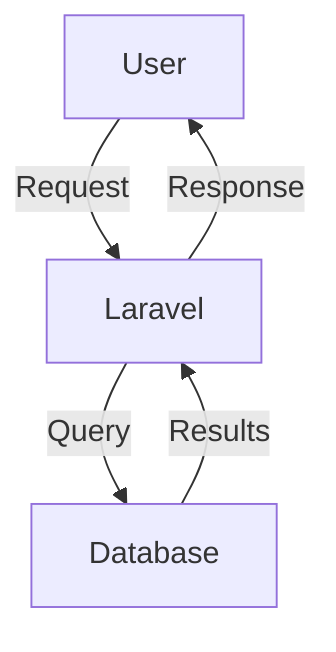

# Zpanel Documentation

Welcome to the Zpanel documentation! This directory contains comprehensive guides for users, developers, and administrators.

## Documentation Structure

### 📘 User Guides (`guides/`)

Start here if you're new to Zpanel:

- **[Getting Started](guides/getting-started.md)** - Set up your development environment
- **[Installation](guides/installation.md)** - Production installation guide
- **[IDE Integration](guides/ide-integration.md)** - Using the built-in web IDE
- **[MCP Integration](guides/mcp-integration.md)** - MCP server usage
- **[Cloudflare Integration](guides/cloudflare-integration.md)** - Cloudflare features

### 🏗️ Architecture (`architecture/`)

Understand how Zpanel works:

- **[System Overview](architecture/system-overview.md)** - High-level architecture
- **[Deployment Flow](architecture/deployment-flow.md)** - How deployments work
- **[Docker Orchestration](architecture/docker-orchestration.md)** - Container management
- **[Data Flow](architecture/data-flow.md)** - How data moves through the system

### 🔌 API Documentation (`api/`)

Integrate with Zpanel programmatically:

- **[API Overview](api/overview.md)** - REST API introduction
- **[Authentication](api/authentication.md)** - API token management
- **[Examples](api/examples.md)** - Code samples and use cases
- **[OpenAPI Spec](../implementation/phase-1/Zpanel/openapi.yaml)** - Complete API reference

### 💻 Development (`development/`)

For contributors and developers:

- **[Code Style Guide](development/code-style.md)** - Coding standards
- **[Testing Strategy](development/testing-strategy.md)** - How to test
- **[Onboarding Guide](development/onboarding.md)** - New developer guide
- **[Pre-commit Setup](development/pre-commit-setup.md)** - Git hooks

### 📊 Project Status

- **[Implementation Status](status.md)** - Current progress and roadmap
- **[Phase 1 Summary](../implementation/phase-1/phase-1-summary.md)** - Foundation work
- **[Phase 2 Planning](../implementation/phase-2/README.md)** - Future features

## Quick Reference

### New Users

1. Start with [Getting Started](guides/getting-started.md)
2. Follow [Installation Guide](guides/installation.md)
3. Explore features through UI
4. Check [API Documentation](api/overview.md) for automation

### New Developers

1. Read [Getting Started](guides/getting-started.md)
2. Review [System Architecture](architecture/system-overview.md)
3. Follow [Onboarding Guide](development/onboarding.md)
4. Check [Code Style Guide](development/code-style.md)
5. Start with [good first issues](https://github.com/freqkflag/Zpanel/labels/good%20first%20issue)

### API Developers

1. Read [API Overview](api/overview.md)
2. Set up [Authentication](api/authentication.md)
3. Try [Examples](api/examples.md)
4. Explore [OpenAPI Spec](../implementation/phase-1/Zpanel/openapi.yaml)

## Contributing to Documentation

Documentation improvements are always welcome!

### How to Contribute

1. Fork the repository
2. Create a branch: `git checkout -b docs/improve-api-guide`
3. Make your changes
4. Submit a pull request

### Documentation Standards

- Use **clear, concise language**
- Include **code examples** where helpful
- Add **diagrams** for complex concepts (Mermaid preferred)
- **Test all commands** and code samples
- Follow **Markdown best practices**
- Include **links** to related docs

### File Naming

- Use **kebab-case**: `getting-started.md`
- Be **descriptive**: `cloudflare-integration.md` not `cf.md`
- Group by **topic**: All API docs in `api/`

## Documentation Tools

### Mermaid Diagrams

Use Mermaid for diagrams:



### Code Blocks

Always specify language:

````markdown
```php
echo "Hello, World!";
```

```bash
npm install
```
````

## Additional Resources

### External Documentation

- **[Laravel Documentation](https://laravel.com/docs)** - Framework reference
- **[Livewire Documentation](https://livewire.laravel.com)** - Frontend components
- **[Docker Documentation](https://docs.docker.com/)** - Container reference
- **[Cloudflare Documentation](https://developers.cloudflare.com/)** - Cloudflare API

### Community

- **GitHub Discussions**: Ask questions
- **Discord**: Real-time chat (link TBD)
- **Issue Tracker**: Report bugs and request features

## Documentation Roadmap

### Completed ✅

- Project overview and README
- Getting started guide
- API documentation basics
- Architecture overviews
- Development guides

### In Progress 🔄

- IDE integration guide
- MCP server documentation
- Cloudflare integration details
- Testing examples

### Planned ⏳

- Video tutorials
- Interactive API explorer
- Architecture diagrams (extended)
- Deployment playbooks
- Troubleshooting database
- Performance tuning guide
- Security hardening guide
- Multi-server deployment guide

## Need Help?

- **Found an error?** [Open an issue](https://github.com/freqkflag/Zpanel/issues/new)
- **Have a question?** [Start a discussion](https://github.com/freqkflag/Zpanel/discussions)
- **Want to contribute?** See [Contributing Guide](../implementation/phase-1/Zpanel/CONTRIBUTING.md)

---

Last updated: November 3, 2025

