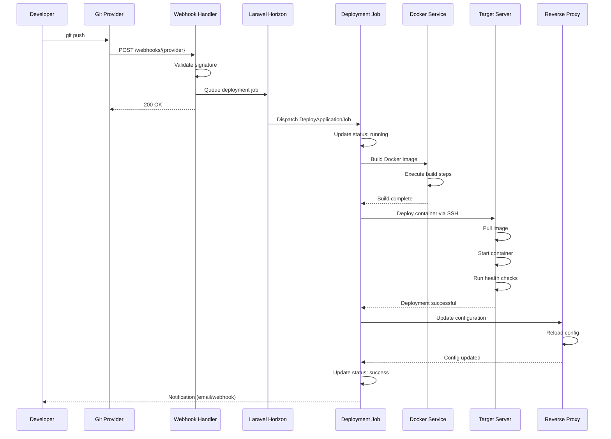

# Deployment Flow Architecture

Detailed explanation of how Zpanel handles application deployments from code push to running container.

## Overview

Zpanel uses a **queue-based deployment system** with automated Docker builds, health checks, and zero-downtime deployments.

## Complete Deployment Flow



## Deployment Stages

### Stage 1: Webhook Reception

**Location**: `routes/webhooks.php` → Controllers

```php
// Webhook validation and job queuing
Route::post('/webhooks/github', [WebhookController::class, 'github']);
Route::post('/webhooks/gitlab', [WebhookController::class, 'gitlab']);
Route::post('/webhooks/bitbucket', [WebhookController::class, 'bitbucket']);
```

**Process:**
1. Receive webhook from Git provider
2. Validate webhook signature
3. Extract branch and commit information
4. Check if deployment should be triggered
5. Queue deployment job
6. Return 200 OK immediately

### Stage 2: Job Queue Processing

**System**: Laravel Horizon (Redis-backed queue)

**Job**: `app/Jobs/ApplicationDeploymentJob.php`

**Process:**
1. Job is dispatched to queue
2. Horizon worker picks up job
3. Job executes deployment logic
4. On failure, retry with exponential backoff
5. Maximum 3 retry attempts

### Stage 3: Source Code Retrieval

**Methods:**
- **Git clone** for first deployment
- **Git pull** for subsequent deployments
- **Specific commit** checkout
- **Submodule** initialization (if enabled)

**Location**: `app/Actions/Application/PrepareSourceCode.php`

### Stage 4: Docker Image Build

**Build Strategies:**

#### A. Dockerfile-based Build
```dockerfile
# Detected Dockerfile in repository
FROM node:18-alpine
WORKDIR /app
COPY package*.json ./
RUN npm ci --production
COPY . .
RUN npm run build
CMD ["npm", "start"]
```

#### B. Nixpacks Auto-detection
- Automatically detects framework
- Generates optimized Dockerfile
- Installs dependencies
- Configures runtime

#### C. Buildpack Integration
- Heroku buildpack compatibility
- Auto-detection of runtime
- Dependency installation
- Build caching

**Build Process:**
1. Select build strategy
2. Generate/use Dockerfile
3. Build Docker image with BuildKit
4. Tag image with version/commit
5. Push to registry (optional)
6. Store build logs

### Stage 5: Container Deployment

**Location**: `app/Actions/Application/DeployContainer.php`

**Process:**
1. Generate Docker Compose configuration
2. Connect to target server via SSH
3. Pull Docker image (if from registry)
4. Stop old container (if exists)
5. Start new container
6. Wait for health check
7. Remove old container (zero-downtime)

**Docker Compose Generation:**
```yaml
version: '3.8'
services:
  app:
    image: ${IMAGE_NAME}:${IMAGE_TAG}
    container_name: ${CONTAINER_NAME}
    restart: unless-stopped
    environment:
      ${ENVIRONMENT_VARIABLES}
    labels:
      - traefik.enable=true
      - traefik.http.routers.${APP_NAME}.rule=Host(`${FQDN}`)
      - traefik.http.services.${APP_NAME}.loadbalancer.server.port=${PORT}
    networks:
      - coolify
    volumes:
      ${VOLUME_MAPPINGS}
```

### Stage 6: Health Checks

**Health Check Methods:**

1. **HTTP Health Check**
   - Send GET request to health endpoint
   - Check for 200 response
   - Configurable path and timeout

2. **Container Status Check**
   - Verify container is running
   - Check resource usage
   - Monitor logs for errors

3. **Custom Health Command**
   - Execute custom health check script
   - Verify exit code
   - Parse health status

**Configuration:**
```php
'healthcheck' => [
    'test' => ['CMD', 'curl', '-f', 'http://localhost/health'],
    'interval' => 30,
    'timeout' => 10,
    'retries' => 3,
    'start_period' => 60
]
```

### Stage 7: Proxy Configuration

**Reverse Proxy Options:**
- **Traefik** (Primary)
- **Caddy** (Alternative)
- **Nginx** (Manual configuration)

**Process:**
1. Generate proxy configuration
2. Update routing rules
3. Configure SSL/TLS certificates
4. Reload proxy configuration
5. Verify routing works

**Traefik Labels:**
```yaml
labels:
  - traefik.enable=true
  - traefik.http.routers.app.rule=Host(`app.example.com`)
  - traefik.http.routers.app.entrypoints=websecure
  - traefik.http.routers.app.tls=true
  - traefik.http.routers.app.tls.certresolver=letsencrypt
```

### Stage 8: Post-Deployment Tasks

**Tasks:**
1. Update deployment status to "success"
2. Store deployment logs
3. Send notifications (email, Discord, Slack)
4. Trigger webhooks (if configured)
5. Update application status
6. Clean up old images/containers

## Deployment Types

### 1. Git-Based Deployment

**Trigger**: Git push to monitored branch

**Flow:**
```
Git Push → Webhook → Queue Job → Build → Deploy → Health Check → Success
```

### 2. Manual Deployment

**Trigger**: User clicks "Deploy" button

**Flow:**
```
User Action → Livewire Component → Queue Job → Build → Deploy → Success
```

### 3. Scheduled Deployment

**Trigger**: Cron schedule

**Flow:**
```
Cron → Scheduler → Queue Job → Build → Deploy → Success
```

### 4. API-Triggered Deployment

**Trigger**: API call

**Flow:**
```
API Call → Controller → Queue Job → Build → Deploy → Success
```

## Deployment Strategies

### Zero-Downtime Deployment

**Process:**
1. Build new image
2. Start new container
3. Wait for health check
4. Switch traffic to new container
5. Stop old container
6. Clean up old resources

**Benefits:**
- No service interruption
- Automatic rollback on failure
- Gradual traffic shift

### Blue-Green Deployment

**Process:**
1. Deploy to "green" environment
2. Run smoke tests
3. Switch traffic from "blue" to "green"
4. Keep "blue" for quick rollback

**Configuration:**
```php
'deployment_strategy' => 'blue-green',
'keep_previous_deployment' => true,
'health_check_timeout' => 60
```

### Rolling Update

**Process:**
1. Update containers one at a time
2. Wait for health check after each
3. Continue if healthy, stop if failed
4. Automatic rollback on failure

## Error Handling

### Build Failures

**Common Causes:**
- Invalid Dockerfile syntax
- Missing dependencies
- Build timeout
- Resource limits exceeded

**Recovery:**
- Store complete build logs
- Mark deployment as failed
- Send error notifications
- Keep previous deployment running

### Deployment Failures

**Common Causes:**
- Container won't start
- Health check failed
- Port already in use
- Insufficient resources

**Recovery:**
- Automatic retry (3 attempts)
- Exponential backoff
- Rollback to previous version
- Alert administrators

### Health Check Failures

**Recovery Actions:**
1. Wait for start period
2. Retry health check (3 attempts)
3. If all fail, mark as failed
4. Keep old container running
5. Notify user

## Monitoring During Deployment

### Real-Time Log Streaming

**Technology**: WebSocket (Soketi)

**Process:**
1. User subscribes to deployment channel
2. Job broadcasts log messages
3. Frontend displays in real-time
4. Logs persist to database

**Example:**
```javascript
Echo.private(`application.${applicationId}`)
    .listen('DeploymentStarted', (e) => {
        console.log('Deployment started');
    })
    .listen('DeploymentLog', (e) => {
        appendLog(e.message);
    })
    .listen('DeploymentCompleted', (e) => {
        console.log('Deployment complete');
    });
```

## Database Migrations During Deployment

### Migration Strategies

**Pre-Deployment Migrations:**
```php
'pre_deployment_command' => 'php artisan migrate --force'
```

**Post-Deployment Migrations:**
```php
'post_deployment_command' => 'php artisan migrate --force && php artisan cache:clear'
```

### Zero-Downtime Migrations

1. **Backward-compatible** migrations only
2. **Additive changes** (new columns, tables)
3. **Deploy new code** that works with both schemas
4. **Remove old code** in next deployment
5. **Clean up old schema** after verification

## Rollback Mechanism

### Automatic Rollback

**Triggers:**
- Health check failure
- Container startup failure
- User-initiated rollback

**Process:**
1. Stop new container
2. Restart previous container
3. Restore previous proxy config
4. Update deployment status
5. Notify user

### Manual Rollback

**Via UI:**
1. Navigate to application
2. Select previous deployment
3. Click "Redeploy"

**Via API:**
```bash
curl -X POST https://your-domain.com/api/v1/applications/{id}/redeploy \
  -H "Authorization: Bearer TOKEN" \
  -d '{"deployment_id": "previous-deployment-id"}'
```

## Performance Optimization

### Build Caching

**Docker BuildKit Cache:**
```dockerfile
# RUN commands with cache mounts
RUN --mount=type=cache,target=/root/.npm npm ci
RUN --mount=type=cache,target=/var/cache/apt apt-get update
```

**Registry Cache:**
- Push build layers to registry
- Reuse layers in subsequent builds
- Significant build time reduction

### Parallel Deployments

- Multiple applications deploy concurrently
- Separate queue for each server
- Resource-based throttling
- Priority-based job ordering

## Additional Resources

- [Docker Orchestration](docker-orchestration.md)
- [Queue System](queue-architecture.md)
- [Deployment Actions](../implementation/phase-1/Zpanel/app/Actions/Application/)
- [Deployment Jobs](../implementation/phase-1/Zpanel/app/Jobs/)

