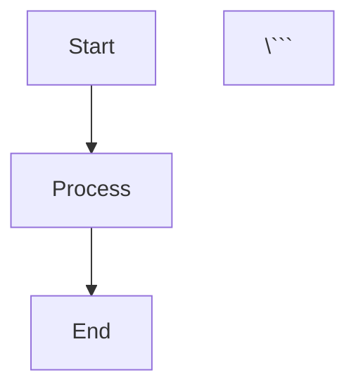

# Zpanel Architecture Diagrams

This directory contains Mermaid diagrams documenting the Zpanel system architecture.

## Available Diagrams

### 1. System Architecture (`system-architecture.mmd`)

**Purpose**: High-level overview of the entire Zpanel system  
**Shows**: 
- User interaction layers (Browser, CLI, API)
- Application components (Web UI, IDE, MCP servers)
- Service layer (IDE, MCP Registry, Cloudflare, Kong)
- Infrastructure services (Kong Gateway, code-server, WebSocket)
- Data layer (PostgreSQL, Redis, Storage)
- External integrations (Cloudflare, GitHub, Docker)
- Agent Supervisor System

**Use this for**: Understanding the overall system architecture and component relationships

### 2. Deployment Flow (`deployment-flow.mmd`)

**Purpose**: Detailed deployment workflow from git push to running application  
**Shows**:
- Git webhook triggering
- Queue-based job processing
- Docker build process with caching
- Container deployment
- Proxy configuration updates
- Health checks and notifications

**Use this for**: Understanding how deployments work and troubleshooting deployment issues

### 3. MCP Integration (`mcp-integration.mmd`)

**Purpose**: Model Context Protocol server framework and integration  
**Shows**:
- Client layer (Cursor IDE, CLI, Web UI)
- MCP Server Framework (Laravel Boost, Registry)
- MCP Servers (Cloudflare, GitHub, Database, Docker, Custom)
- Service integration (Cloudflare API, Kong Gateway)
- Data storage
- External API connections

**Use this for**: Understanding MCP server architecture and adding new MCP servers

### 4. Agent Supervisor (`agent-supervisor.mmd`)

**Purpose**: Agent supervisor system architecture  
**Shows**:
- HTTP API layer
- Supervisor core (Monitor, Registry, IPC)
- 8 autonomous agent workers
- Execution environments (Fork, Docker)
- Monitoring and logging
- Configuration management

**Use this for**: Understanding the agent supervisor system and creating new agents

## Viewing Diagrams

### Online Viewers
- **Mermaid Live Editor**: https://mermaid.live/
- **GitHub**: Automatically renders `.mmd` files
- **VS Code**: Install "Markdown Preview Mermaid Support" extension

### Command Line
```bash
# Install mermaid-cli
npm install -g @mermaid-js/mermaid-cli

# Generate PNG
mmdc -i system-architecture.mmd -o system-architecture.png

# Generate SVG
mmdc -i system-architecture.mmd -o system-architecture.svg
```

### In Documentation
Include diagrams in Markdown files:
```markdown


## Diagram Conventions

### Color Coding
- **Blue** (#4A90E2): User-facing components
- **Green** (#50C878): Application/MCP layer
- **Orange** (#FFB84D): Service layer
- **Purple** (#9B59B6): Infrastructure services
- **Red** (#E74C3C): Data layer
- **Gray** (#95A5A6): External integrations
- **Teal** (#1ABC9C): Agent workers

### Line Styles
- **Solid arrows** (-->): Direct connections/calls
- **Dotted arrows** (-.->): Optional/async connections
- **Dashed arrows** (- ->): Data flow

### Node Shapes
- **Rectangle**: Services/Components
- **Rounded**: User interfaces
- **Cylinder** ([ ]): Databases
- **Hexagon** {{ }}: External services

## Updating Diagrams

When updating diagrams:
1. Edit the `.mmd` source file
2. Validate syntax at https://mermaid.live/
3. Update this README if adding new diagrams
4. Commit changes with clear description

## Integration with Documentation

These diagrams are referenced in:
- `/docs/architecture/system-overview.md`
- `/docs/guides/getting-started.md`
- `/README.md`
- `/PHASE-1-ACTUAL-STATUS.md`

## Generating Additional Diagrams

Need more diagrams? Consider creating:
- **Database schema** (ER diagrams)
- **Authentication flow** (OAuth/Sanctum)
- **MCP tool interaction** (detailed tool calls)
- **Agent lifecycle** (state transitions)
- **API request flow** (REST API usage)

Use the Agent Supervisor's `data-transformer` agent to convert data models to diagram formats, or `api-caller` to fetch external schema data.

---

**Created**: November 3, 2025  
**Last Updated**: November 3, 2025  
**Maintainer**: Zpanel Team
